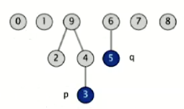
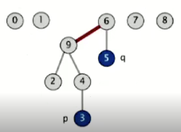

# Union-Find problem

## Quick-find (lazy approach)

Data structure:

- **integer array `id[]` of size N**
- **interpretation: `id[i]` is parent of i**
- **Root of `i` is `id[id[id[...id[i]...]]]`**
  
 

  

  |   `i`   | 0   | 1   | 2   | 3   | 4   | 5   | 6   | 7   | 8   | 9   |
  | :-----: | --- | --- | --- | --- | --- | --- | --- | --- | --- | --- |
  | `id[i]` | 0   | 1   | 9   | 4   | 9   | 6   | 6   | 7   | 8   | 9   |

  root of 3 is 9, root of 5 is 6

- **find (connected): check if p and q have the same root**

`id[3] = 9` and `id[5] = 6` so 3 and 5 are not connected

 

- **union: to merge components containing p and q, set the `id[]` of `p`'s root to the `id` of `q`'s root**
  

|   `i`   | 0   | 1   | 2   | 3   | 4   | 5   | 6   | 7   | 8   | 9                   |
| :-----: | --- | --- | --- | --- | --- | --- | --- | --- | --- | ------------------- |
| `id[i]` | 0   | 1   | 9   | 4   | 9   | 6   | 6   | 7   | 8   | 6 |

union(3, 5): the root of 3 is 9 and the root of 5 is 6, so set the `id` of `p`'s root to the `id` of `q`'s root, 6
